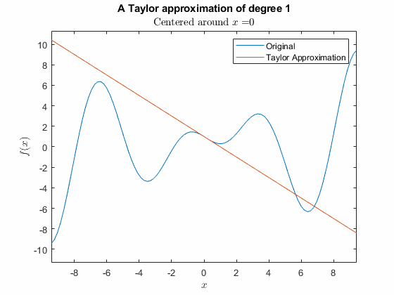

# Cálculo: Derivadas

 or 

**Módulo de Currículo**

_Creado con R2021a. Compatible con R2021a y versiones posteriores._

# Información

Este módulo de currículo contiene [scripts en vivo de MATLAB®](https://www.mathworks.com/products/matlab/live-editor.html) interactivos que enseñan conceptos fundamentales y terminología básica relacionada con el cálculo de derivadas. Se hace énfasis en la aproximación numérica y la representación gráfica como herramientas para comprender los conceptos del cálculo.

Este módulo ha sido traducido automáticamente del inglés.

## Antecedentes

Puedes usar estos scripts en vivo como demostraciones en clases, actividades en el aula o asignaciones interactivas fuera de clase. El módulo de derivadas está dividido en cinco scripts y una aplicación de práctica. El primero cubre la [definición de límite de la derivada](#H_727F8117) e incluye varios ejemplos motivadores para el estudio de las derivadas. El segundo cubre [derivadas de potencias y la linealidad de las derivadas](#H_77AFFCCB) trabajando desde la definición de límite de la derivada, incluyendo una aplicación al movimiento parabólico. El tercero cubre [derivadas de exponenciales, logaritmos naturales, senos y cosenos](#H_9F419170), así como la discusión de derivadas de orden superior. Las aplicaciones incluyen el crecimiento poblacional y el comportamiento oscilatorio. El cuarto script presenta visualizaciones de [la regla del producto y la regla de la cadena para derivadas](#H_DBF5C0DF), así como problemas de práctica generados aleatoriamente. Las aplicaciones incluyen tasas relacionadas y la regla del cociente para derivadas. El quinto script presenta [la aproximación de funciones diferenciables](#H_98D870A0) por polinomios, incluyendo líneas tangentes y llegando a los polinomios de Taylor. La [aplicación de Tarjetas de Cálculo](#H_A8913F44) permite a los usuarios seleccionar los tipos de reglas de derivadas (o integrales) que desean practicar, generar problemas aleatorios y seguir su progreso dentro de una sesión.

Las instrucciones dentro de los scripts en vivo te guiarán a través de los ejercicios y actividades. Todos los ejercicios interactivos ofrecen retroalimentación, mientras que las preguntas de reflexión son más abiertas y no incluyen soluciones en este módulo. Comienza con cada script en vivo ejecutándolo una sección a la vez. Para detener la ejecución del script o una sección a mitad de camino (por ejemplo, cuando una animación está en progreso), usa el botón  **Detener** en la sección **EJECUTAR** de la pestaña **Live Editor** en la barra de herramientas de MATLAB.

## Contáctenos

Las soluciones están disponibles a solicitud del instructor. Contacta al [equipo de recursos educativos de MathWorks](mailto:onlineteaching@mathworks.com) si deseas solicitar soluciones, proporcionar retroalimentación o si tienes alguna pregunta.

## Prerrequisitos

Matemáticamente, este módulo asume un conocimiento de funciones que es estándar en los materiales de cursos de precálculo con respecto a potencias, exponenciales, valores absolutos, logaritmos, senos, cosenos, funciones racionales y asíntotas. Además, este módulo asume una fluidez básica con límites al discutir la definición de límite de la derivada.

Se requiere una fluidez mínima en MATLAB para usar este módulo; principalmente es matemática estándar tipo calculadora, como usar \texttt{*} para multiplicación y <samp>/</samp> para división. Para comandos que van más allá de interactuar con una calculadora, el conocimiento necesario está incluido en el módulo. Si deseas mejorar tu conocimiento de MATLAB, [MATLAB Onramp](https://matlabacademy.mathworks.com/details/matlab-onramp/gettingstarted) es un tutorial introductorio gratuito de dos horas que enseña lo esencial de MATLAB.

## Cómo Empezar
### Acceder al Módulo
### **En MATLAB Online:**

Usa el enlace  para descargar el módulo. Se te pedirá que inicies sesión o crees una cuenta de MathWorks. El proyecto se cargará y verás una aplicación con varias opciones de navegación para comenzar.

### **En Escritorio:**

Descarga o clona este repositorio. Abre MATLAB, navega a la carpeta que contiene estos scripts y haz doble clic en [Derivatives.prj](https://matlab.mathworks.com/open/github/v1?repo=MathWorks-Teaching-Resources/Calculus-Derivatives_es&project=Derivatives.prj). Esto añadirá los archivos apropiados a tu ruta de MATLAB y abrirá una aplicación que te preguntará por dónde te gustaría empezar.

Asegúrate de tener instalados todos los productos requeridos ([listados a continuación](#H_E850B4FF)). Si necesitas incluir un producto, agrégalo usando el Add-On Explorer. Para instalar un complemento, ve a la pestaña **Inicio** y selecciona  **Complementos** > **Obtener Complementos**.

## Productos

Se utilizan MATLAB® y Symbolic Math Toolbox™ en todo el módulo. Las herramientas de Curve Fitting Toolbox™ se utilizan en <samp>TranscendentalsRules.mlx</samp>.

# Scripts

## [La Definición de la Derivada](https://matlab.mathworks.com/open/github/v1?repo=MathWorks-Teaching-Resources/Calculus-Derivatives_es&project=Derivatives.prj&file=Scripts/Definition.mlx)
| **<samp>Definition.mlx</samp>** | **En este script, los estudiantes...**  |
| :-- | :-- |
|  |-  explicarán la definición de límite de la derivada y su relación con las líneas secantes.  -  identificarán el signo de la derivada en un punto como positivo, negativo o cero basado en la gráfica de una función.  -  identificarán puntos donde la derivada de una función continua no existe y explicarán por qué con referencia a la definición de la derivada.  -  reconocerán $f^{\prime } (x)$ , $\frac{\textrm{d}f}{\textrm{d}x}$ , y $\frac{\textrm{d}}{\textrm{d}x}\left\lbrack f(x)\right\rbrack$ como notación equivalente para la derivada de $f$ con respecto a $x$ .  |

## [Derivadas de Polinomios](https://matlab.mathworks.com/open/github/v1?repo=MathWorks-Teaching-Resources/Calculus-Derivatives_es&project=Derivatives.prj&file=Scripts/PowerRules.mlx&focus=true)
| **<samp>PowerRules.mlx</samp>** | **En este script, los estudiantes...**  |
| :-- | :-- |
|  |-  explicarán por qué la definición de límite de la derivada resulta en la regla de la potencia para derivadas.  -  calcularán las derivadas de combinaciones lineales de potencias a mano.  -  aplicarán derivadas para resolver preguntas prácticas.  |

## [Derivadas de Funciones Trascendentales](https://matlab.mathworks.com/open/github/v1?repo=MathWorks-Teaching-Resources/Calculus-Derivatives_es&project=Derivatives.prj&file=Scripts/TranscendentalsRules.mlx&focus=true)
| **<samp>TranscendentalsRules.mlx</samp>** | **En este script, los estudiantes...**  |
| :-- | :-- |
|  |-  determinarán la relación funcional de las derivadas de senos, cosenos, exponenciales y logaritmos naturales.  -  explicarán el patrón en las derivadas de $\sin (ax)$ , $\cos (ax)$ , y $\exp (ax)$ para valores constantes de $a$ y que la derivada de $\ln (ax)$ no se ajusta al patrón simple.  -  aplicarán las unidades correctas a derivadas de cualquier orden.  -  explorarán ecuaciones diferenciales simples de primer y segundo orden que describen un sistema físico y las usarán para crear modelos matemáticos del sistema.  |

## [Regla de la Cadena y Regla del Producto](https://matlab.mathworks.com/open/github/v1?repo=MathWorks-Teaching-Resources/Calculus-Derivatives_es&project=Derivatives.prj&file=Scripts/TranscendentalsRules.mlx&focus=true)
| **<samp>CombinationRules.mlx</samp>** | **En este script, los estudiantes...**  |
| :-- | :-- |
|  |-  explicarán por qué la regla de la cadena es $\frac{\textrm{d}}{\textrm{d}x}\left\lbrack f(g(x))\right\rbrack =f^{\prime } (g(x)) \cdot g^{\prime } (x)$ .  -  aplicarán la regla de la cadena para calcular derivadas.  -  explicarán por qué la regla del producto es $\frac{\textrm{d}}{\textrm{d}x}\left\lbrack f(x)\cdot g(x)\right\rbrack =f(x)\cdot \frac{\textrm{d}g}{\textrm{d}x}+\frac{\textrm{d}f}{\textrm{d}x}\cdot g(x)$ .  -  aplicarán la regla del producto para calcular derivadas.  -  practicarán reconociendo y aplicando fluidamente las reglas para calcular derivadas.  |

## [Polinomios de Taylor](https://matlab.mathworks.com/open/github/v1?repo=MathWorks-Teaching-Resources/Calculus-Derivatives_es&project=Derivatives.prj&file=Scripts/TaylorPolynomials.mlx&focus=true)
| **<samp>TaylorPolynomials.mlx</samp>** | **En este script, los estudiantes...**  |
| :-- | :-- |
|  |-  calcularán líneas tangentes.  -  calcularán aproximaciones cuadráticas.  -  calcularán aproximaciones polinómicas de orden superior.  |

# App: [Tarjetas Educativas de Cálculo](https://matlab.mathworks.com/open/github/v1?repo=MathWorks-Teaching-Resources/Calculus-Derivatives_es&project=Derivatives.prj&file=Apps/TarjetasDeCalculo.m&focus=true)

Practica reconociendo y resolviendo problemas computacionales estándar en cálculo.

# Licencia

La licencia para este módulo está disponible en el archivo [LICENSE.md](https://github.com/MathWorks-Teaching-Resources/Calculus-Derivatives/blob/release/LICENSE.md).

# Módulos de Curso Relacionados
| **Módulo de Curso** | **Contenido de Muestra** | **Disponible en:**  |
| :-- | :-- | :-- |
| [**Cálculo: Integrales**](https://www.mathworks.com/matlabcentral/fileexchange/105740-calculus-integrals) |  |    [GitHub](https://github.com/MathWorks-Teaching-Resources/Calculus-Integrals)   |
| [**Análisis de Fourier**](https://www.mathworks.com/matlabcentral/fileexchange/135291-analisis-de-fourier) |  |   [GitHub](https://github.com/MathWorks-Teaching-Resources/Fourier-Analysis_es)  |
|  [**Métodos Numéricos con Aplicaciones** (en inglés)](https://www.mathworks.com/matlabcentral/fileexchange/111490-numerical-methods-with-applications) |  |      [GitHub](https://github.com/MathWorks-Teaching-Resources/Numerical-Methods-with-Applications)   |

O siéntete libre de explorar nuestro otro [contenido modular de cursos](https://www.mathworks.com/matlabcentral/fileexchange/?q=tag%3A%22courseware+module%22&sort=downloads_desc_30d).

# Recursos para Educadores
-  [Página para Educadores](https://www.mathworks.com/academia/educators.html) 

# Contribuir 

¿Buscas más? ¿Encontraste un problema? ¿Tienes una sugerencia? Por favor, contacta al [equipo de recursos educativos de MathWorks](mailto:%20onlineteaching@mathworks.com). Si deseas contribuir directamente a este proyecto, puedes encontrar información sobre cómo hacerlo en la página [CONTRIBUTING.md](https://github.com/MathWorks-Teaching-Resources/Calculus-Derivatives/blob/release/CONTRIBUTING.md) en GitHub.

*©* Copyright 2024 The MathWorks™, Inc

